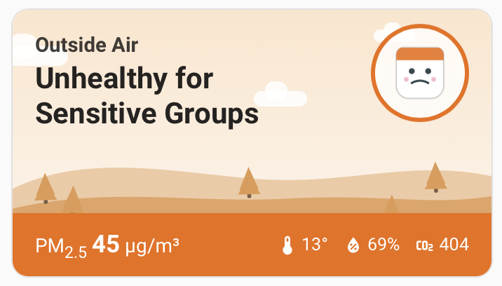
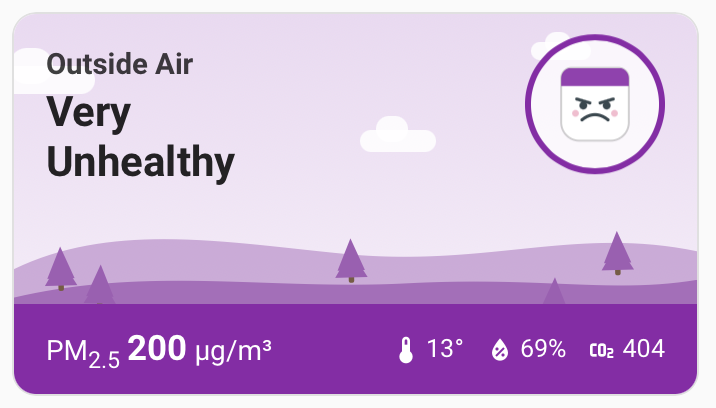

# Air Quality Scene Card

An animated Home Assistant dashboard card for **any air-quality sensor** — IKEA ALPSTUGA,
AirGradient, Awair, PurpleAir, ESPHome builds, or anything else that exposes a PM2.5 or CO₂
`sensor` entity. Link a sensor, and the whole scene — sky, hills, and the mascot's mood —
shifts with the air quality, so a glance tells you the state of the air before you read a
number.

<p align="center">
  <a href="https://my.home-assistant.io/redirect/hacs_repository/?owner=keranm&repository=air-quality-scene-card&category=dashboard">
    
  </a>
</p>

<p align="center">
  
</p>

| | | |
|---|---|---|
|  |  |  |
| **Good** | **Moderate** | **Unhealthy for Sensitive Groups** |
|  |  |  |
| **Unhealthy** | **Very Unhealthy** | **Hazardous** |

This is the standalone-card sibling of
[airgradient-public](https://github.com/keranm/airgradient-public), which bundles the same UI
with an integration for public AirGradient map locations. This card has **no integration and
no API** — it reads whatever sensor entities you already have.

## Features

- **Compact view**: an animated scene — drifting clouds, a bobbing mascot whose face and
  colour follow the air-quality category — with the current reading and temperature /
  humidity / CO₂ (or PM2.5) chips auto-discovered from the same device.
- **Tap to expand** into a detail sheet with a colour-coded **24-hour chart**, **12 h / 24 h
  averages**, metric-specific insight tiles, and a **10-days-by-hour heatmap**, all built
  from Home Assistant's own recorder statistics.
- **Two primary metrics**, selectable per card:

  | `metric: pm25` (default) | `metric: co2` |
  |---|---|
  | US EPA May-2024 PM2.5 categories (Good → Hazardous) | Indoor-ventilation categories (Fresh → Extreme) |
  | WHO annual-guideline comparison tile | Peak-in-last-24 h tile |
  | Cigarettes-equivalent tile | Time-above-1000 ppm tile |

  The CO₂ mode is made for rooms where CO₂ builds up naturally — an office or streaming room
  with the door shut — where ventilation matters more than particulates.

## Installation

### HACS (recommended)

The quickest way — click the button, which opens your Home Assistant with this repository
pre-filled in HACS:

[](https://my.home-assistant.io/redirect/hacs_repository/?owner=keranm&repository=air-quality-scene-card&category=dashboard)

Then click **Download** and reload your browser when prompted. HACS registers the dashboard
resource automatically — no restart needed for a dashboard card.

<details>
<summary>Or add it manually as a custom repository</summary>

1. In HACS, open the three-dot menu → **Custom repositories**.
2. Add `https://github.com/keranm/air-quality-scene-card` with category **Dashboard**.
3. Find **Air Quality Scene Card**, click **Download**.
4. Reload your browser when prompted.

</details>

### Manual

Copy `dist/air-quality-scene-card.js` to `config/www/` and add a dashboard resource
(Settings → Dashboards → ⋮ → Resources):

```yaml
url: /local/air-quality-scene-card.js
type: module
```

> 💡 **After installing or updating**, hard-refresh your browser once
> (**Cmd/Ctrl + Shift + R**) so it loads the new JavaScript.

## Usage

The card appears in the dashboard card picker as **“Air Quality Scene Card”** with a full
visual editor — pick the metric, pick the sensor, done. Or by YAML:

```yaml
# PM2.5 (default) — e.g. an IKEA ALPSTUGA
type: custom:air-quality-scene-card
entity: sensor.quinns_room_quinn_air_quality_pm2_5
```

```yaml
# CO₂ as the primary reading — for that door-shut streaming room
type: custom:air-quality-scene-card
metric: co2
entity: sensor.quinns_room_quinn_air_quality_carbon_dioxide
name: Quinn's Room
```

Temperature, humidity, and the other pollutant (CO₂ in PM2.5 mode, PM2.5 in CO₂ mode) are
auto-discovered from sibling entities on the **same device**, so `entity` is usually the only
option you need. If the metric is omitted, it is inferred from the entity's `device_class`.

### Options

| Option | Required | Description |
|---|---|---|
| `entity` | ✅ | The sensor to display (PM2.5 or CO₂). |
| `metric` | – | `pm25` or `co2`. Default: inferred from the entity's device class. |
| `name` | – | Override the title (defaults to the device name). |
| `temperature` | – | Explicit temperature entity (otherwise auto-detected). |
| `humidity` | – | Explicit humidity entity (otherwise auto-detected). |
| `co2` | – | Explicit CO₂ chip entity in PM2.5 mode (otherwise auto-detected). |
| `pm25` | – | Explicit PM2.5 chip entity in CO₂ mode (otherwise auto-detected). |

## How the history charts work

The expanded view is built entirely from **Home Assistant's recorder statistics**, so the
sensor needs `state_class: measurement` (true for ALPSTUGA and virtually all modern
integrations). The charts **start empty and fill in over time**: the 24-hour chart after a
few hours, the 10-day heatmap and 30-day tiles over the following days. The compact card is
live immediately.

## Try the different states

Use **Developer Tools → States**: pick your sensor, set its **State**, and click **Set
state** — the card recolours instantly (the integration's next poll restores the real value).

| PM2.5 (µg/m³) | CO₂ (ppm) | Category |
|---|---|---|
| `2` | `500` | Good / Fresh |
| `20` | `900` | Moderate / Acceptable |
| `45` | `1200` | Unhealthy for Sensitive Groups / Getting Stuffy |
| `80` | `1800` | Unhealthy / Stuffy — Ventilate |
| `200` | `3000` | Very Unhealthy / Poor |
| `300` | `6000` | Hazardous / Extreme |

## Notes on methodology

- **PM2.5 categories** use the [US EPA May-2024 breakpoints](https://www.airnow.gov/aqi/aqi-basics/).
- **WHO comparison** uses the 2021 annual PM2.5 guideline of **5 µg/m³**.
- **Cigarette equivalent** uses the [Berkeley Earth](https://berkeleyearth.org/air-pollution-and-cigarette-equivalence/)
  rule of thumb: a day breathing **22 µg/m³** of PM2.5 ≈ one cigarette.
- **CO₂ categories** follow common indoor-air guidance: outdoor air is ~420 ppm, ~1000 ppm
  is the long-standing "ventilate" line (Pettenkofer number, echoed by ASHRAE 62.1 guidance),
  drowsiness and complaints are typical by 1500–2000 ppm, and **5000 ppm** is the OSHA
  8-hour workplace exposure limit.
